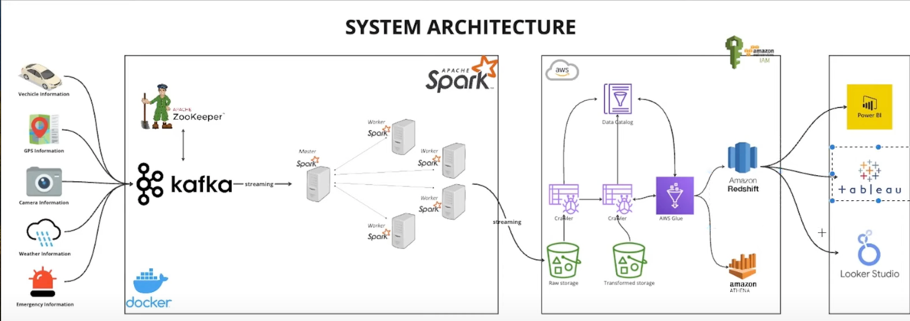
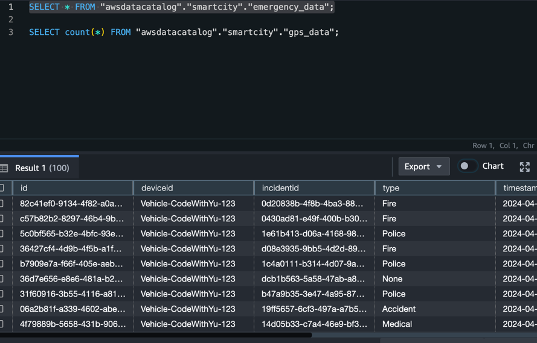

This project is to track drivers information from One destination to another destination

to build up this project we have use Zookeeper, Docker, Kafka,
Apache Spark, AWS S3,AWS GLUE, AWS DATA CATALOG, RED SHIFT

System Architecture:

<<<<<<< HEAD

Purpose of this project was to load the Kafka live streaming vehicle data to AWS redshift

=======
>>>>>>> d8b76a6bb0401dab8350281f82703454d432e137
